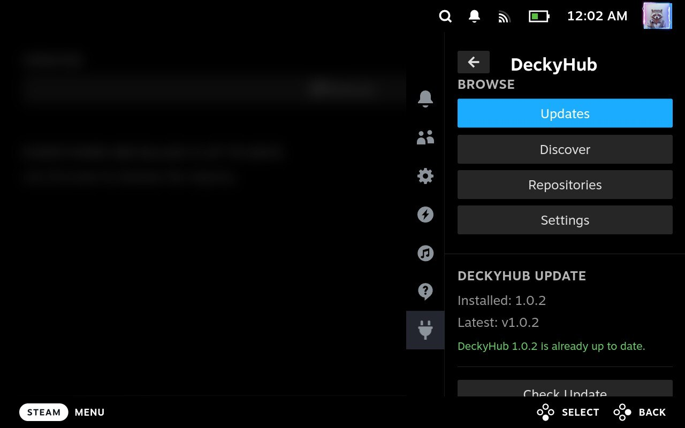
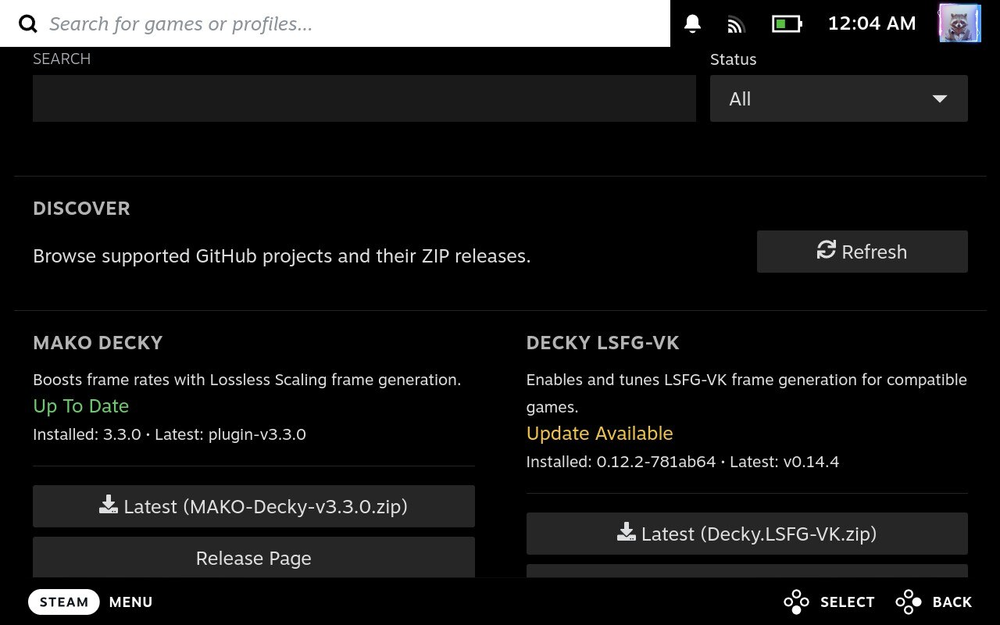
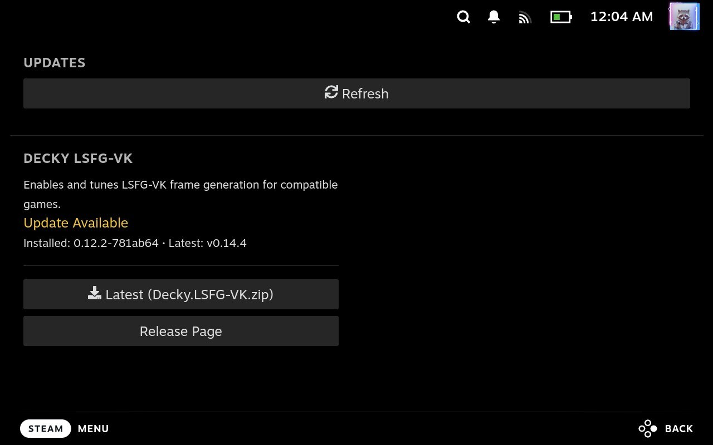

# DeckyHub

### Menu

### Discover

### Updates

**Your Steam Deck's plugin store — right inside Gaming Mode.**

Tired of tabbing out to Desktop Mode, hunting through GitHub releases, and manually downloading ZIPs every time a plugin updates? DeckyHub brings plugin discovery and updates straight to your controller. Browse a curated catalog of the best Steam Deck tools, track any GitHub repo you want, and get notified the moment an update drops — all without leaving your couch.

It ships with a small curated list of popular Steam Deck tools, and you can add any GitHub repository you like.

> **A note on how this is made.** Most of DeckyHub's code was written with the help of AI tools (Claude and Codex). That doesn't mean it ships untested — every release is verified on real hardware before it goes out. I'm telling you this upfront so you know exactly what you're installing and how it got built.

## Why you'll like it

- **Never miss an update** — DeckyHub checks your installed plugins against their latest GitHub releases and pings you with a toast the moment something new is available.
- **No more zip-hunting** — search, download, and see exactly which release asset you need without opening a browser.
- **Built for the couch** — full gamepad navigation, color-coded status at a glance, and one-tap downloads designed for Gaming Mode, not a desktop browser squeezed onto a small screen.
- **You stay in control** — for every app/plugin DeckyHub tracks, it only downloads files; it never installs or runs anything automatically. Nothing touches your system until you say so. The one exception is updating DeckyHub itself, where you can opt into a one-tap automatic update alongside the classic download-and-install-yourself option.

## What it does

- **Discover** — browse a curated list of Steam Deck plugins/tools, filter by search or installed status, and see release info at a glance, color-coded by status.
- **Updates** — see which of your tracked, installed tools have a newer release available, and download updates in one tap. You'll also get a toast notification when new updates show up.
- **Repositories** — two tabs: **Add & Manage** to search GitHub, add or remove tracked repositories, and export/import your list; **Repository Settings** for release-channel and asset-keyword overrides.
- **Settings** — shows the fixed DeckyHub download folder, toggles overwriting existing files, checks for DeckyHub's own updates, and lets you pick how many items show per row (1–3) in the app grid. A separate **Cleanup** section clears the download folder's contents with confirmation.

For every tracked app/plugin, DeckyHub only **downloads** files — it never installs or runs anything automatically. After a download finishes, you install it yourself from Desktop Mode via Decky → Developer → Install Plugin from ZIP. This keeps you in control of what actually runs on your system. The only exception is DeckyHub's own updates, which offer an optional one-tap automatic install (see [Keeping DeckyHub itself updated](#keeping-deckyhub-itself-updated)).

## Bundled repositories

No setup, no configuration — these show up in Discover the moment you install DeckyHub:

| Tool | Category | Repository |
| --- | --- | --- |
| MAKO Decky | Frame Generation | [eugeniosegala/MAKO](https://github.com/eugeniosegala/MAKO) |
| Decky LSFG-VK | Frame Generation | [xXJSONDeruloXx/decky-lsfg-vk](https://github.com/xXJSONDeruloXx/decky-lsfg-vk) |
| Unifideck | Game Libraries | [mubaraknumann/unifideck](https://github.com/mubaraknumann/unifideck) |
| Decky Framegen | Frame Generation | [xXJSONDeruloXx/Decky-Framegen](https://github.com/xXJSONDeruloXx/Decky-Framegen) |
| Nexus Mods | Mod Managers | [RedRanger14/decky-nexus](https://github.com/RedRanger14/decky-nexus) |

Want more? Add any other GitHub repository from **Repositories → Add & Manage** in seconds.

## Installing DeckyHub

1. Make sure [Decky Loader](https://decky.xyz/) is installed.
2. Download the latest `DeckyHub-v*.zip` from the [Releases page](https://github.com/mazillka/deckyhub-plugin/releases).
3. In Gaming Mode, open the Quick Access Menu → Decky → Developer → **Install Plugin from ZIP**, and select the downloaded file.
4. Open Quick Access Menu → Decky → **DeckyHub**.

## Using DeckyHub

### Discover

Browse the bundled list or search within it, and filter by **Status** — All, Installed, or Not Installed. Each card is color-coded (green once it's up to date, yellow when an update is available, red on an error) so you can spot what needs attention at a glance. Tap **Download Latest** on any card to grab the recommended release asset, or one of the other listed assets from that release.

To track a repository that isn't in the curated list, go to **Repositories**, search for it, and add it — it'll show up in Discover from then on.

### Updates

Shows every tracked tool that's installed and has a newer release available, along with its installed and latest version. Download updates one at a time.

### Downloads

All downloads are saved to `/home/deck/Downloads/deckyhub`. Settings can clear that folder after confirmation. Starting a download opens a progress dialog with a **Cancel** button; once it finishes, the same dialog shows where the ZIP was saved and how to install it. If a download is interrupted, no partial file is left behind.

When GitHub provides a checksum for a release asset, DeckyHub always verifies it before keeping the download. By default, downloading a file again overwrites the previous copy; turn off **Overwrite Existing Files** in Settings if you'd rather keep both.

### Repositories

Two tabs:

- **Add & Manage** — search GitHub for a repository and tap **Add** (repositories you already track show **Already Added** instead, so you can tell at a glance). Results page five at a time. Export your custom repositories to `DeckyHub-repositories.json` in `/home/deck/Downloads` to back them up or share them, or import that file back in. Any repository you've added can be removed again here; the curated repositories that ship with DeckyHub stay available and can't be removed. Prefer a bigger screen? The [Registry Editor](https://mazillka.github.io/deckyhub-plugin/) is a browser-based tool for building or editing a repository list file before importing it.
- **Repository Settings** — per-repository controls: switch a repository between stable and pre-release, or filter which release assets show up (comma-separated keywords).

### Keeping DeckyHub itself updated

Settings includes a **Check Update** option that looks for new stable releases (or pre-releases, if you opt in) of DeckyHub itself. A newer release triggers a notification; an installed matching package reports that no update is available. When an update is available, you get two ways to install it:

- **Update Automatically** — hands the release off to Decky Loader's own installer (the same one the Decky Store uses), which downloads, verifies, and installs it in place. No manual ZIP step needed.
- **Download ZIP** — the classic path: saves the update ZIP to `/home/deck/Downloads/deckyhub`, which you then install yourself via Decky → Developer → Install Plugin from ZIP.

If automatic update isn't available for some reason (e.g. running inside an older Decky Loader build), fall back to Download ZIP.

## Good to know

- DeckyHub talks to GitHub without needing you to log in, so very heavy use in a short time may hit GitHub's public rate limit — release info will just take a bit longer to refresh if that happens.
- Release information is cached for 1 minute, so pulling to refresh right after checking won't always show something new.
- Downloads only ever happen over HTTPS.

## Disclaimer

DeckyHub is only a discovery and download tool. All rights to the plugins and tools listed in its registry belong to their respective authors; DeckyHub does not own, endorse, or take responsibility for any third-party repository or its content.

## Getting help

Found a bug or have an idea? Open an issue on the [GitHub repository](https://github.com/mazillka/deckyhub-plugin/issues) with a description of what happened — feedback and suggestions are always welcome.

Want to build DeckyHub from source or contribute a change? See [CONTRIBUTING.md](CONTRIBUTING.md).
