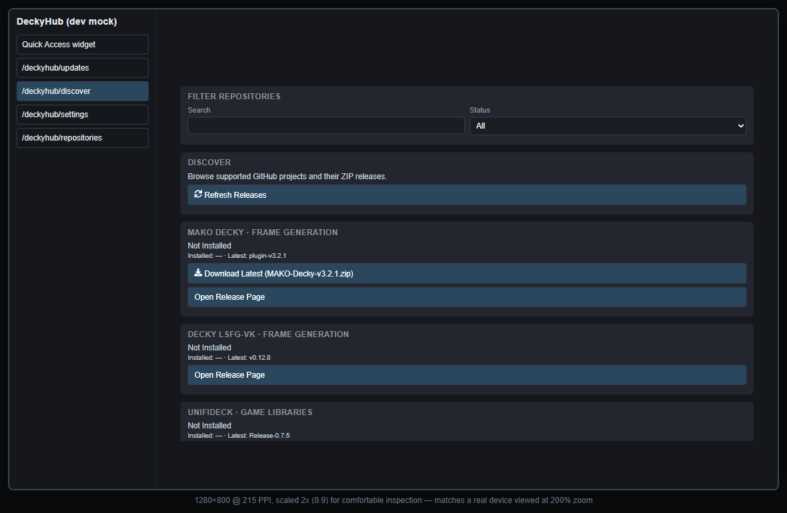

# decky-mock

Local, browser-based preview of DeckyHub's UI, for iterating on `src/` without a Steam Deck.

**What's real:** `src/` is imported unmodified. All backend calls (`get_apps`, `download_asset`, settings, etc.) go through `dev-server.py` to the actual `main.py` `Plugin` class — same logic, same registry, same GitHub API calls the real plugin makes.

**What's fake:** `@decky/ui` and `@decky/api` are swapped (via a Vite alias) for [ui.tsx](ui.tsx) and [api.ts](api.ts) — plain styled `<div>`/`<button>` stand-ins. The real `@decky/ui` components are scraped at runtime from Steam's own webpack bundle (they call `findModuleExport()` internally, confirmed by reading `node_modules/@decky/ui/src`), so there is no way to get pixel-accurate Decky styling outside the actual Steam Client. This mock is for exercising **layout and logic**, not for visual QA — always do a final check on real hardware (or `steam -gamepadui` on Linux) before shipping a UI change.

## Run it

Two processes, both from this folder:

```bash
python dev-server.py   # backend bridge on :8642 — talks to the real main.py
npm install             # first time only
npm run dev              # frontend on :5183
```

Open the printed `http://localhost:5183` URL. The left nav lists the QAM widget plus every route `src/index.tsx` registers (Updates, Discover, Repositories, Settings).



## Known limitations

- `openFilePicker()` is a `window.prompt()` for an absolute path — there's no native file dialog in a browser. Good enough to test the import flow if you paste a real path on your machine.
- `Navigation.NavigateToExternalWeb()` opens a new browser tab instead of Steam's overlay browser.
- Toasts, modals, and tabs are simplified divs/buttons, not Steam's real components.
- The backend bridge stores its settings/registry cache under `.dev-data/` (gitignored) instead of `~/.config/decky-loader/...`, and fakes `decky.DECKY_HOME` for the "installed plugin" scan — so nothing here will ever show as "installed" unless you create fake `plugin.json` files under `.dev-data/plugins/<name>/`.
- This whole `devtools/` folder is standalone tooling with its own `package.json` — it's not part of the plugin build and isn't shipped in releases.
